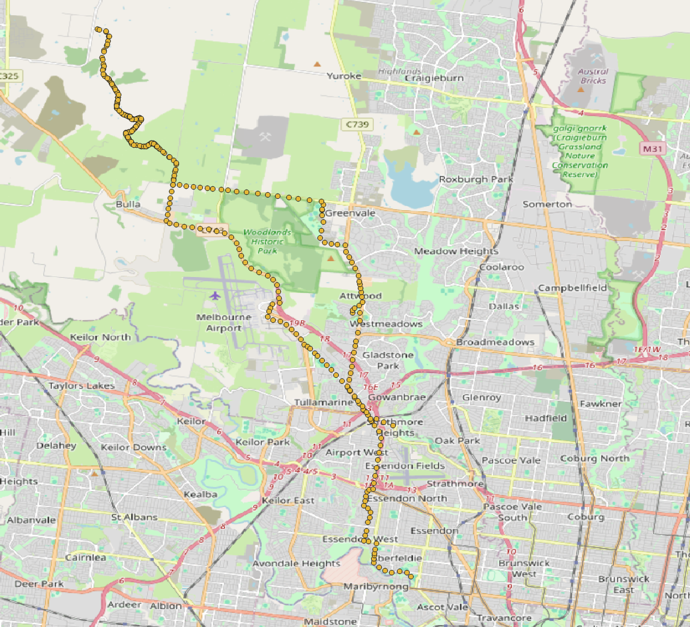
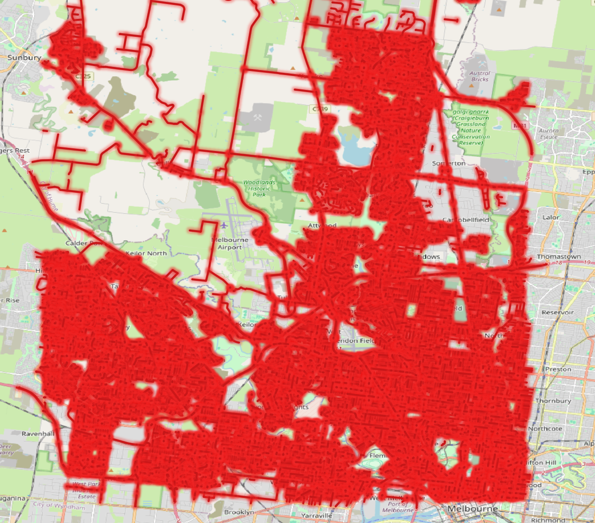
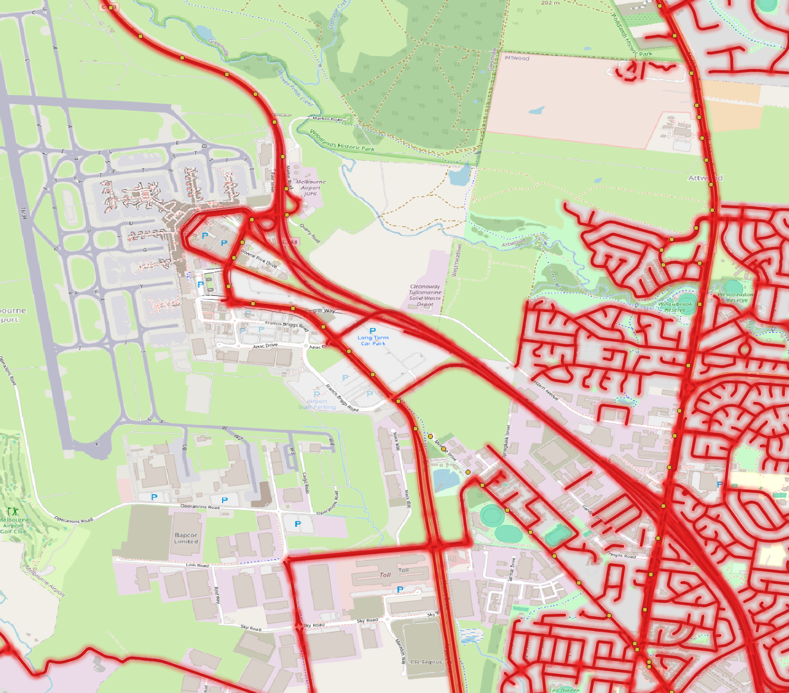
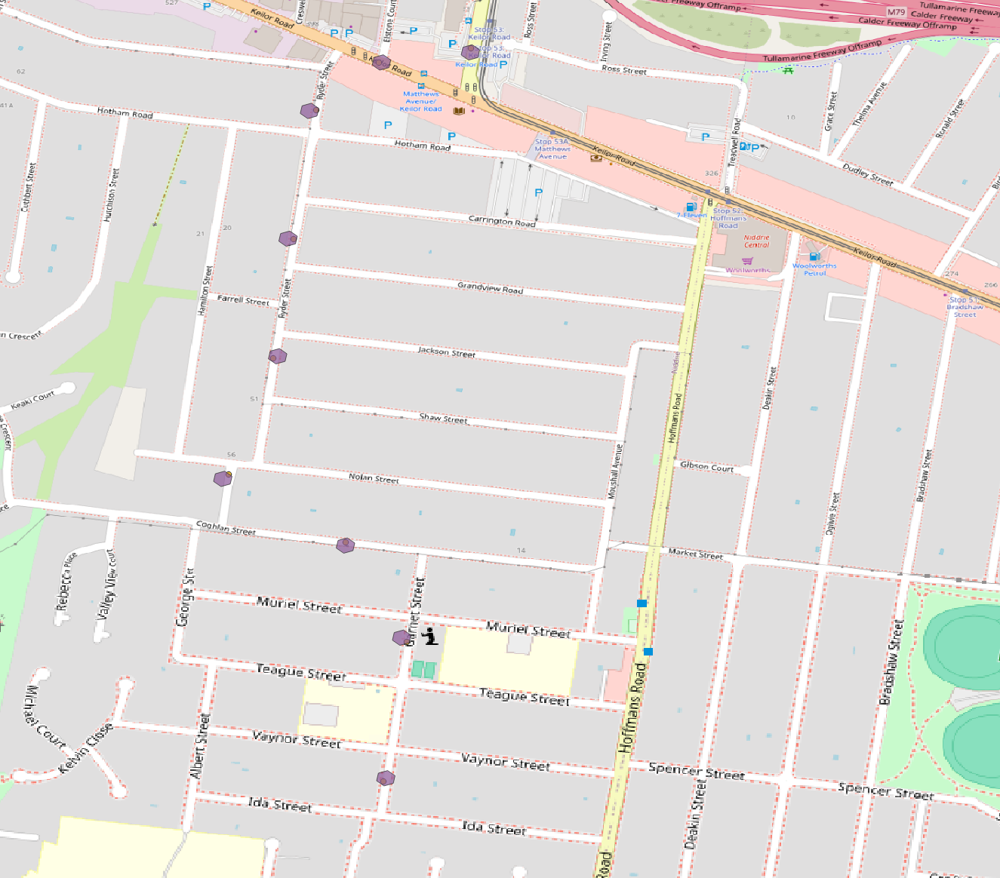
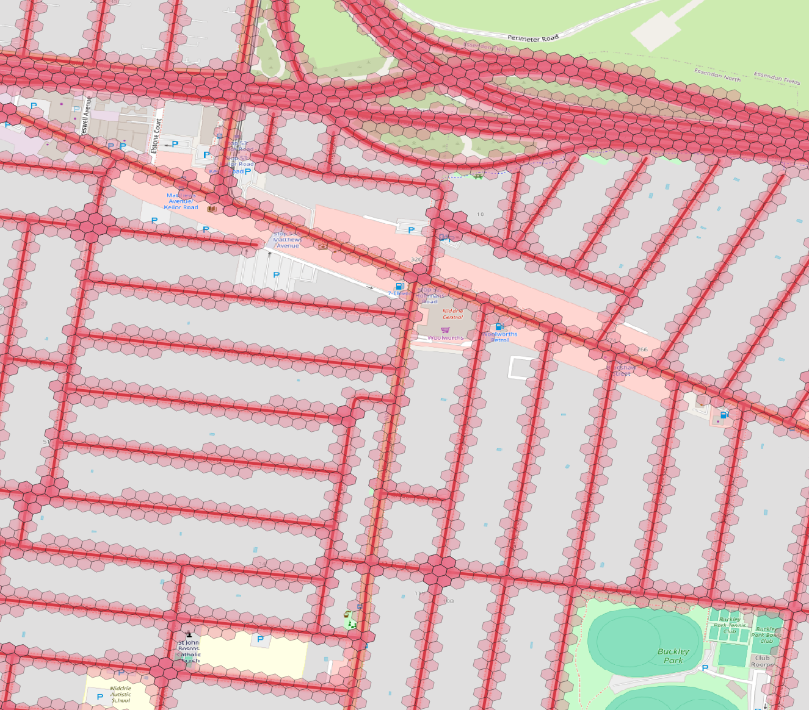
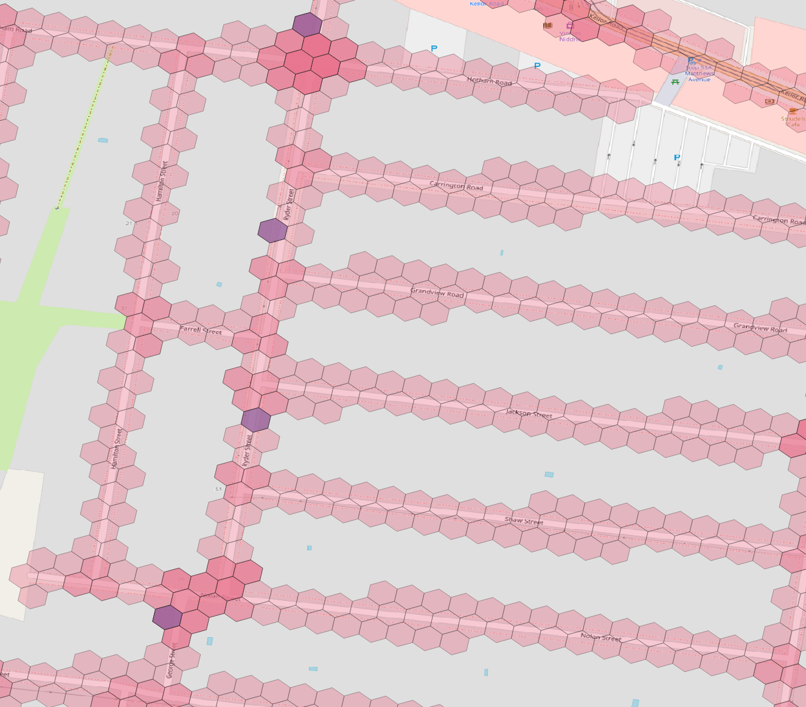

# Austroads - Road mapping using Uber h3

Using uber h3 indexing map GPS points to road segments. In PostGIS context, we'll use two approaches:

- Calculate distance from the road segments using ST_Distance
- Using uber h3 index to match with the roads

## Hypothesis

Using uber h3 should be much faster as it works with matching pre-computed h3 indexes(base64 integer) where a lot of postgres optimizations can also be applied for faster matching.

### Setup

Start the postgres with postgres extension preloaded

```bash
# start the container
docker run -it --name postgis-h3 -d -p 6432:5432 -e POSTGRES_PASSWORD=postgres jsonsingh/postgis-h3
# copy sample data inside the container
docker container cp sample-data.csv postgis-h3:/home
```

Setting up the postgres environment

```bash
# the below might be different based on your environment
PGPASSWORD=postgres -p 6432 -d postgres -U postgres -h localhost
```

```SQL
-- Create database
CREATE database austroads;
-- Connect to the database
\c austroads;
-- Create extensions
CREATE extension h3;
CREATE extension h3_postgis CASCADE;
-- Verify the extensions
\dx;
```

The output should look something like this

```text
                                    List of installed extensions
      Name      | Version  |   Schema   |                        Description
----------------+----------+------------+------------------------------------------------------------
 h3             | 4.1.2    | public     | H3 bindings for PostgreSQL
 h3_postgis     | 4.1.2    | public     | H3 PostGIS integration
 plpgsql        | 1.0      | pg_catalog | PL/pgSQL procedural language
 postgis        | 3.4.0dev | public     | PostGIS geometry and geography spatial types and functions
 postgis_raster | 3.4.0dev | public     | PostGIS raster types and functions
```

Using the following csv format

```csv
pos_id,ivu_id,record_dto,position_latitude,position_longitude,record_number,record_cluster
```

```SQL
-- Create table with raw values (will format later)
CREATE TABLE
    tracking_data_raw (
        pos_id INT,
        ivu_id VARCHAR,
        record_dto VARCHAR,
        position_latitude VARCHAR,
        position_longitude VARCHAR,
        record_number VARCHAR,
        record_cluster VARCHAR
    );

-- Copy the raw into table
COPY tracking_data_raw FROM '/home/sample-data.csv' DELIMITER ','CSV HEADER;

-- Create the actual table
CREATE TABLE
    tracking_data (
        pos_id INT,
        ivu_id VARCHAR,
        record_dto TIMESTAMP,
        position_latitude FLOAT,
        position_longitude FLOAT,
        record_number VARCHAR,
        record_cluster DATE
    );

-- Insert the data from raw table while correcting the format
INSERT INTO tracking_data  (pos_id, ivu_id, record_dto, position_latitude, position_longitude, record_number, record_cluster)
SELECT
    pos_id::INT,
    ivu_id,
    TO_TIMESTAMP(record_dto , 'DD/MM/YYYY HH24:MI:SS'),
    position_latitude::FLOAT * -1,
    position_longitude::FLOAT,
    record_number,
    TO_DATE(record_cluster , 'DD/MM/YYYY')
FROM
    tracking_data_raw;
```



For roads, we'll use an OSM export of Melbourne area. Special thanks to HOTOSM for making the export tool. [https://export.hotosm.org/](https://export.hotosm.org/)

```bash
PGPASSWORD=postgres -p 6432 -d austroads -U postgres -h localhost -f roads-data/
```

```SQL
-- All kinds of roads
SELECT DISTINCT
    highway
FROM
    melbourne_roads
ORDER BY
    highway;

-- Of Interest for Joining GPS coordinates
SELECT
    COUNT(*)
FROM
    melbourne_roads
WHERE
    "highway" IN (
        'motorway',
        'motorway_link',
        'primary',
        'primary_link',
        'secondary',
        'secondary_link',
        'tertiary',
        'residential'
    );
-- 33225 records
```




### Analysis

In our analysis we need to join the road with the GPS points, for that we'll

- Create point geometry
- Create h3 index at multiple levels trading between speed and accuracy
- Create h3 index for roads

Documentation: [https://pgxn.org/dist/h3/docs/api.html](https://pgxn.org/dist/h3/docs/api.html)

```SQL

-- Create point geometry
ALTER TABLE tracking_data
ADD COLUMN point geometry (Point, 4326) generated always AS (
    ST_SetSRID (
        st_makepoint (position_longitude, position_latitude),
        4326
    )
) stored;

-- Create h3 index from the Point Geometry where N can be any value from 0-15.
-- We'll use the index level 12 for this example
ALTER TABLE tracking_data
ADD COLUMN h3_index_12 h3index GENERATED ALWAYS AS (
    h3_lat_lng_to_cell (
        ST_SetSRID (
            st_makepoint (position_longitude, position_latitude),
            4326
        ),
        12
    )
) STORED;

-- Purely for visualizing purpose we'll create h3 index boundary
ALTER TABLE tracking_data
ADD COLUMN h3_index_12_shape geometry GENERATED ALWAYS AS (
    h3_cell_to_boundary_geometry (
        h3_lat_lng_to_cell (
            ST_SetSRID (
                st_makepoint (position_longitude, position_latitude),
                4326
            ),
            12
        )
    )
) STORED;
```



For the roads table we need to:

- Create array of h3 index representing the roads
- Flat out the array in a table (it's much faster to do the joins)

```SQL
-- Function that returns array of h3 index given a geometry
CREATE OR REPLACE FUNCTION get_h3_indexes(shape geometry, index integer)
  RETURNS h3index[] AS $$
DECLARE
  h3_indexes h3index[];
BEGIN
  SELECT ARRAY(
    SELECT h3_polygon_to_cells(shape, index)
  ) INTO h3_indexes;

  RETURN h3_indexes;
END;
$$ LANGUAGE plpgsql IMMUTABLE;

-- We need polygons to represent roads
ALTER TABLE melbourne_roads
ADD COLUMN h3_indexes h3index[] GENERATED ALWAYS AS (
    get_h3_indexes(
        ST_Buffer(geom, 0.0001801802),
        12
    )
) STORED;

-- Let's create a table representing the roads as h3index
CREATE TABLE
    melbourne_roads_flat AS
SELECT
    h3_index,
    osm_id,
    highway,
    h3_cell_to_boundary_geometry (h3_index)
FROM
    (
        SELECT
            UNNEST (h3_indexes) AS h3_index,
            osm_id,
            highway
        FROM
            melbourne_roads
    ) AS a;
```



Moment of truth

```SQL
-- Join using Intersects or ST_Distance
SELECT
    p.pos_id,
    array_agg (l.osm_id)
FROM
    tracking_data p
    LEFT JOIN melbourne_roads l ON (
        ST_Intersects (p.point, l.geom)
        OR ST_Distance (p.point, l.geom) < 0.000134
    )
WHERE
    l.highway IN (
        'motorway',
        'motorway_link',
        'primary',
        'primary_link',
        'secondary',
        'secondary_link',
        'tertiary',
        'residential'
    )
GROUP BY
    p.pos_id
ORDER BY
    p.pos_id;
-- 900ms

-- Join using h3 index
SELECT
    p.pos_id,
    array_agg ()
FROM
    tracking_data p
    LEFT JOIN melbourne_roads_flat l ON p.h3_index_12 = l.h3_index
WHERE
    l.highway IN (
        'motorway',
        'motorway_link',
        'primary',
        'primary_link',
        'secondary',
        'secondary_link',
        'tertiary',
        'residential'
    )
GROUP BY
    p.pos_id
ORDER BY
    p.pos_id;
-- 130ms
```



While the difference is not considerable as of now but it'll be significant with a larger sample size. The results are comparable with some points matching to multiple roads and some things are slightly different due to different algorithms. The acccuracy of the h3 index join can be increased by using a smaller index but the speed will suffer for it.
